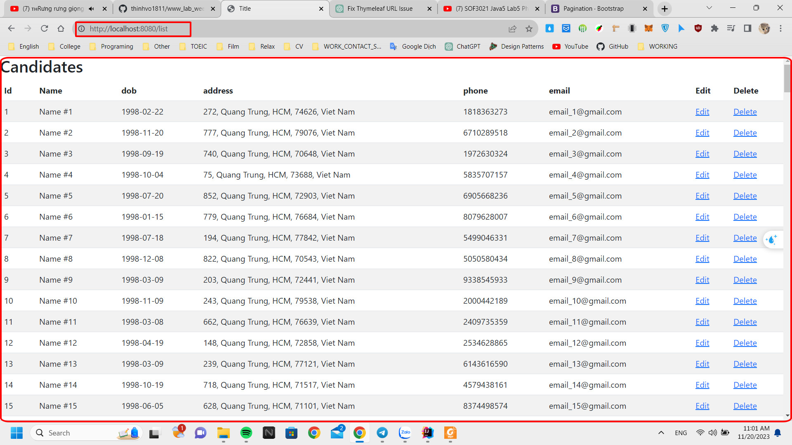
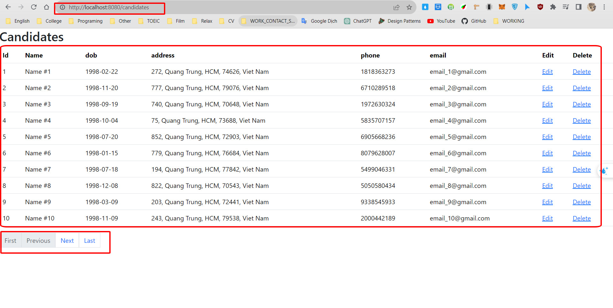
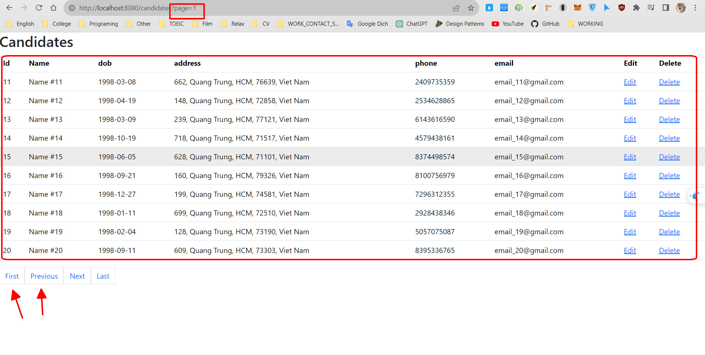
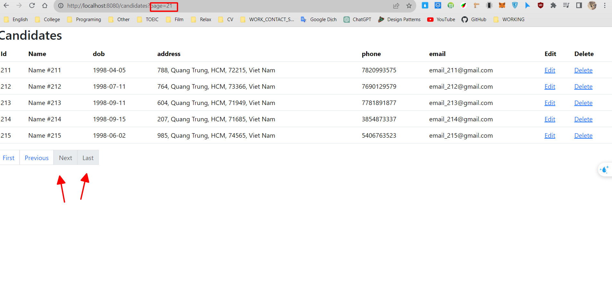

# www_lab5_week06_20014641_VoNguyenThanhTu
Bài tập thực hành lab 5 tuần 6 WWW

<h1 align="center">Hi 👋, I'm Vo Nguyen Thanh Tu</h1>

- ✍ I'm a student of: [Industrial University of Ho Chi Minh City](https://iuh.edu.vn/).
- ✍ Subject : WWW với Công nghệ java
- ✍ Content: Nội dung bài tập lab 5

 

# 📒Hoạt độnng:
<table style="width:100%;">
  <tr>
    <td>
      
      
    </td>
    <td>
      
 
        
      

    </td>
  </tr>
</table>

# 📒Kĩ năng áp dụng trong Project :

  
  
  
  

# 📒Yêu cầu Project :

  Thực hành vê việc phân trang

# 😍Trình bày về project:

  Khi chưa có phân trang

 
  Khi đã có phân trang

  Khi đã có phân trang( khi đứng ở trang đâu tiên)

 
  Khi đã có phân trang( khi nhấn các nút chuyển)

 
  Khi đã có phân trang( khi đứng ở trang cuối)

 
============================================================

